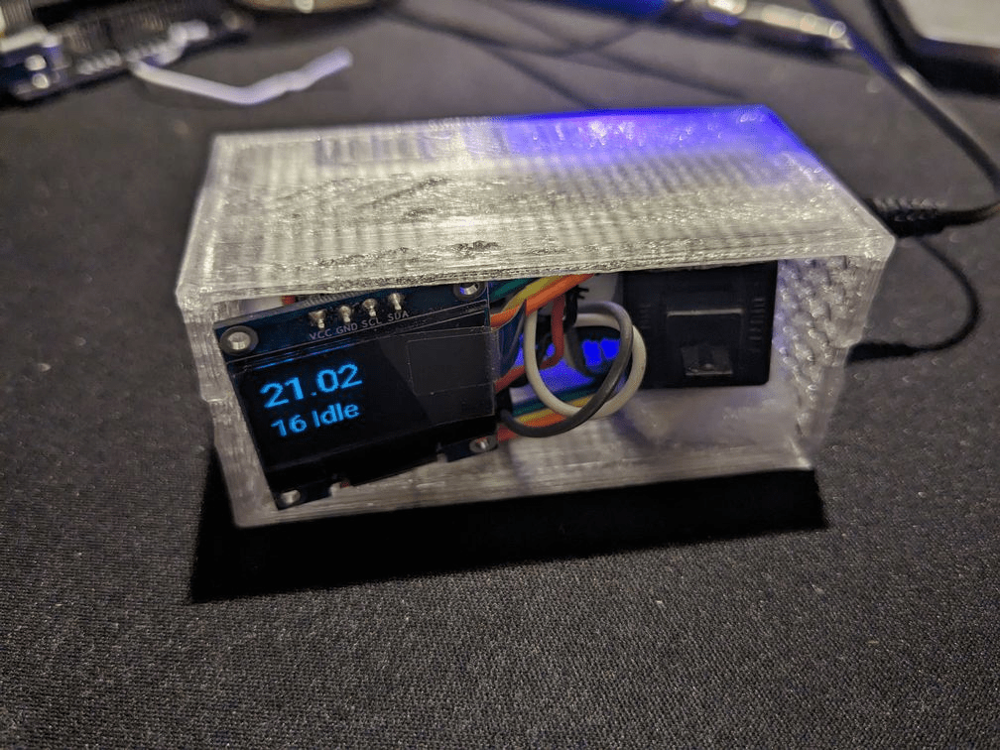
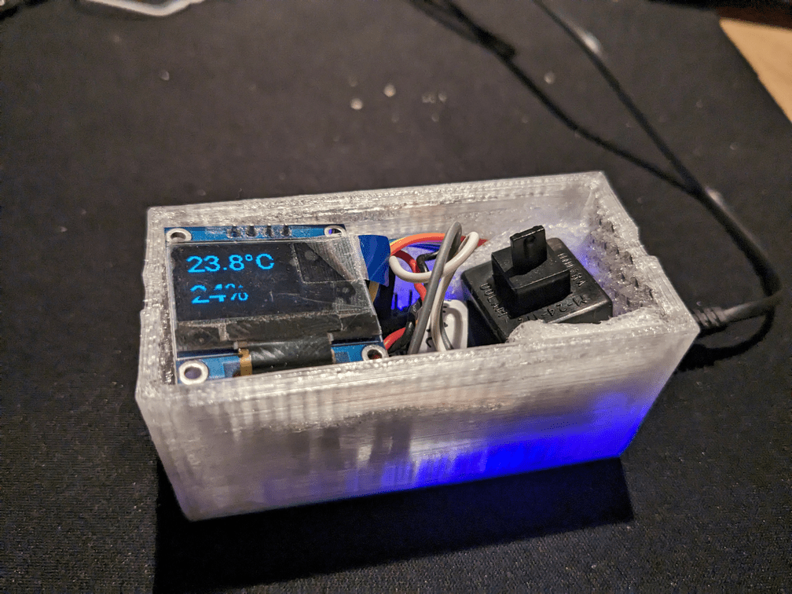

# esphome-pomodoro

[esphome](https://esphome.io/) [Pomodoro](https://en.wikipedia.org/wiki/Pomodoro_Technique)
with OLED display, button and a buzzer.

## Features

- shows remaining time left till the end of the phase
- default work phase is 25min, rest phase is 5min, max 3 work phases
- restores number of work phases on device power loss
- can show some useless info like time and humidity and temperature if you have
  data from home-assistant, could be replaced with something else local
- pomodoro reset counter via web only

## Known limitations

- tested with esphome 2025.6.2 `ghcr.io/esphome/esphome:2025.6.2`

- right now pomodoro cycle consists of two phases - work and break - after that
  you need to manually push button to trigger the pomodoro cycle again.

- no physical button to reset number of pomodoro sessions stored,
  but this can be done via web ui

- tested with OLED 128x64 only
- device power loss does not resume phase, given phase state is lost

## Todo

- short rest phase
- long rest phase
- phase counters
- button 1 - start/pause
- button 2 - break (long press)
- if paused = blinking

- flash screen instead of buzzer

## Bill of materials

- esp32 (probably will work on esp8266)
- [push button](https://en.wikipedia.org/wiki/Push-button)
  or can be some standalone keyboard key or from the old mouse)
- [SSD1306](https://esphome.io/components/display/ssd1306.html) OLED display
- [RTTL buzzer](https://esphome.io/components/rtttl.html)

## Hardware installation

Check [pinout fo your device](https://letmegooglethat.com/?q=esp32+pinout+image).

- buzzer - GPIO32 + ground, check polarity, some require it
- physical button - GPIO33 + ground - make sure you connect proper legs
- OLED display - 5V + ground, I2C over standard pins
  sda: GPIO21
  scl: GPIO22

## Software Installation

### Compile locally

Useful for testing another devices.

- make sure to have secrets.yaml for substitutions like wifi name/password
- copy esp.yaml.dist to a new file my-device.yaml
- edit my-device.yaml just as normal esphome device config
- install [uv](https://docs.astral.sh/uv/getting-started/installation/)
  and run `make dep` (or just see `dependencies` in pyproject.toml and install
  them via pip)
- `make run DEV=my-device.yaml`

### ESPHome Dashboard

- look at the [pomodoro.yaml](./pomodoro.yaml) and
  edit it so it suits your needs - like device address, wifi passwords,
  or uncomment the code etc
- add that yaml to your ESPHome dashboard
- upload to the device
- enjoy.
